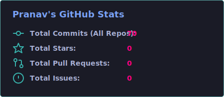
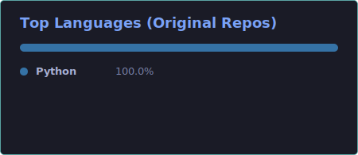

# Hello World! I'm Pranav Aggarwal 👋

  

---

### ⚡ About Me
- 🔭 I’m currently working on building a robust **Payment Gateway Orchestrator Service**.
- 🛠️ Deep diving into scalable architecture, microservices, and system design patterns.
- 🤖 Building interactive chatbots in **Python** using **Streamlit**.
- ☁️ Experienced in deploying Node.js applications on **AWS EC2** environments.
- 🌱 Constantly learning, experimenting with recreating technologies from scratch to build rock-solid engineering foundations.

---

### 📁 Interactive Projects Showcase (Click to expand!)

  
<strong>💳 Payment Orchestrator Service</strong> <em>(React, Node.js, Express, MongoDB)</em>

   
  A merchant orchestration platform designed to route transactions to optimal providers based on dynamic policies.
  <ul>
    <li><strong>Smart Routing</strong>: Real-time decision-making for transaction routing across Stripe, Razorpay, and PayPal.</li>
    <li><strong>Checkout Simulation</strong>: Sandbox environment simulating network latency, API success rates, and merchant dashboards.</li>
    <li><strong>Frontend</strong>: Interactive dashboard built with React + Tailwind CSS v4 for real-time transaction monitoring.</li>
  </ul>

  
<strong>🤖 Streamlit Chatbot</strong> <em>(Python, Streamlit)</em>

   
  An interactive conversational agent leveraging Streamlit for simple UI deployment and backend AI integration.
  <ul>
    <li><strong>Python Powered</strong>: Fast-loading reactive interface.</li>
    <li><strong>Session Management</strong>: Remembers user context and maintains clean chat histories.</li>
  </ul>

  
<strong>🌐 AWS Node.js Deployer</strong> <em>(AWS EC2, Node.js)</em>

   
  Deployment configurations and pipelines for running Node.js applications on AWS EC2 instances with zero-downtime guidelines.

---

### 🛠️ Tech Stack & Skills

| Category | Technologies / Tools |
| --- | --- |
| **Languages** |    |
| **Frontend** |     |
| **Backend** |    |
| **Databases** |  |
| **DevOps & Cloud** |   |

---

### 📊 GitHub Analytics

  
  

  

---

### 🤝 Let's Connect
- **Email**: [pranavaggarwal.in@gmail.com](mailto:pranavaggarwal.in@gmail.com)
- **LinkedIn**: [Pranav Aggarwal](https://www.linkedin.com/in/pranav-aggarwal/)
